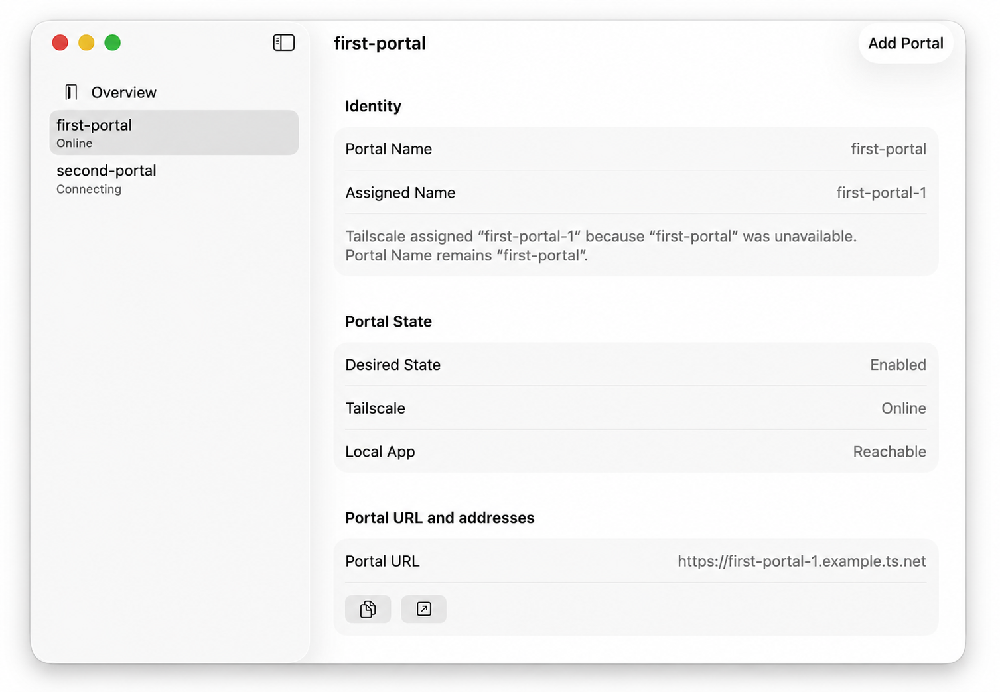
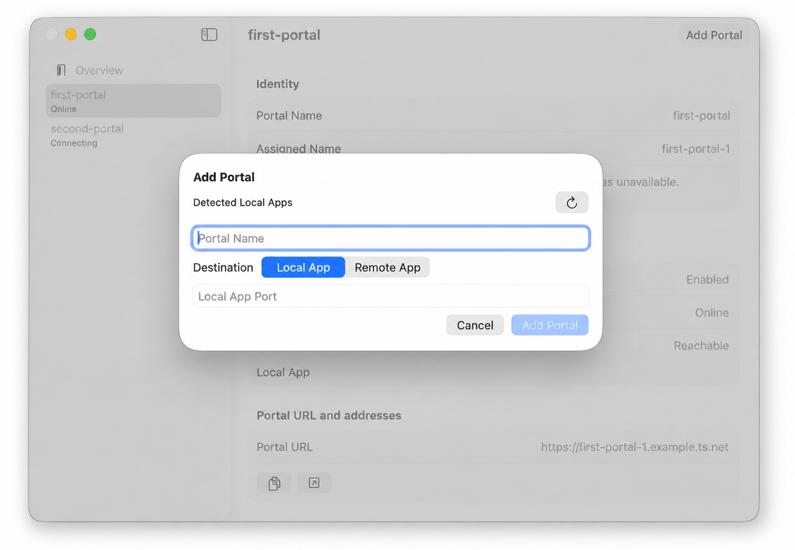
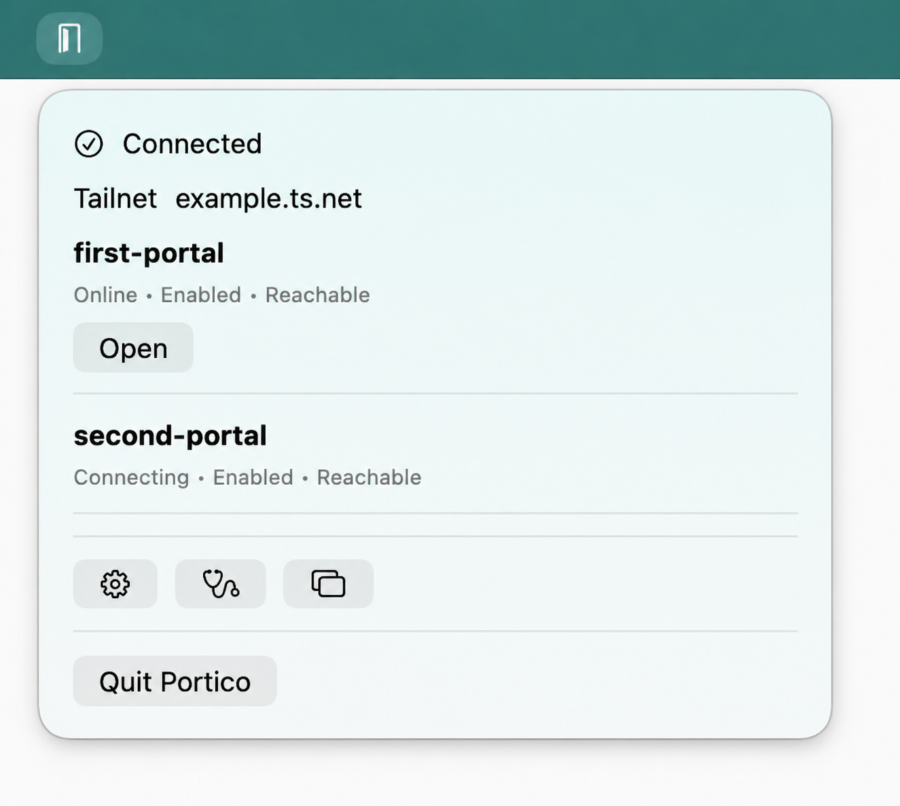

# Portico

> Your local apps, through a private door.

Portico is a native macOS menu-bar app for giving web services reachable from
your Mac stable, private HTTPS addresses on a [Tailscale](https://tailscale.com/)
tailnet.

It creates an independent **Portal** for each service. A Portal keeps its own
Tailscale identity and URL, so you can share a durable private address without
putting the service on the public internet or routing it through your Mac's
existing Tailscale node.


## What the app provides

- Stable HTTPS URLs for services running on the Mac, such as
  `http://127.0.0.1:8787` becoming `https://hermes.<tailnet>.ts.net`.
- Multiple independent Portals, each with an immutable Portal Name and a
  Tailscale-assigned identity.
- Local App destinations on the Mac and Remote App destinations reachable over
  the Mac's normal network.
- Browser authentication for each Portal, without asking you to manage auth
  keys.
- A menu-bar control and focused management window for daily work.
- Clear, separate state for the desired state, Tailscale connection, and
  destination reachability.
- Start, stop, repoint, copy, open, diagnose, and remove controls for each
  Portal.

## See it in action

The management window keeps the important facts together: the Portal's
identity, assigned name, connection state, destination reachability, and
private URL.



Creating a Portal starts with a detected Local App or an explicitly configured
Local App or Remote App destination.



The screenshots use example data from the native UI test fixture; they do not
represent a released build or a live tailnet.

The menu-bar popover is the everyday control surface: check Portal state,
open a private URL, or jump to settings, diagnostics, and the full management
window without leaving the menu bar.



## How it works

1. **Choose a destination.** Select a detected Local App or enter a Local App
   or Remote App destination.
2. **Create a Portal.** Choose a durable Portal Name and complete browser
   authentication for its independent Tailscale node.
3. **Use the private URL.** Copy or open the Portal URL from the menu bar or
   management window wherever your tailnet can reach it.

Access remains governed by your Tailscale tailnet policy. Portico provides the
private doorway; it does not add a second application-level authorization layer.

## Current status

Portico is in active development and is not yet packaged as a public release.
The repository is the source of truth for the current executable, helper, and
MVP behavior. The planned release and installation flow will be documented when
it is ready.

You will need:

- An Apple silicon Mac running macOS 14 or later.
- A Tailscale tailnet with MagicDNS and HTTPS certificates enabled.
- A web service reachable from the Mac.

Portico is a selected working name and has not yet been legally cleared.

## Build from source

Prerequisites:

- Xcode 26.3 selected with `xcode-select`
- Go 1.26.5
- [XcodeGen 2.46.0](https://github.com/yonaskolb/XcodeGen/releases/tag/2.46.0)

Generate the local Xcode project, build, and launch:

```shell
./Scripts/generate-xcode-project.sh
xcodebuild \
  -project Portico.xcodeproj \
  -scheme Portico \
  -destination 'platform=macOS' \
  -derivedDataPath .build/xcode \
  build
open .build/xcode/Build/Products/Debug/Portico.app
```

Run the Swift unit tests, native UI tests, and Go helper tests:

```shell
xcodebuild \
  -project Portico.xcodeproj \
  -scheme Portico \
  -destination 'platform=macOS' \
  -derivedDataPath .build/xcode-unit \
  test
xcodebuild \
  -project Portico.xcodeproj \
  -scheme 'Portico UI Tests' \
  -destination 'platform=macOS' \
  -derivedDataPath .build/xcode-ui \
  test
(cd helper && go build ./cmd/portico-helper && go test ./...)
```

For the generated-project check and local app smoke test, see the scripts in
[`Scripts/`](Scripts/).

## Learn more

- [Domain language](CONTEXT.md)
- [MVP specification](docs/portico-mvp-spec.md)
- [Architectural decisions](docs/adr/)
- [Preliminary naming check](docs/naming.md)
- [Roadmap](docs/roadmap.md)
- [Marketing site](website/)
